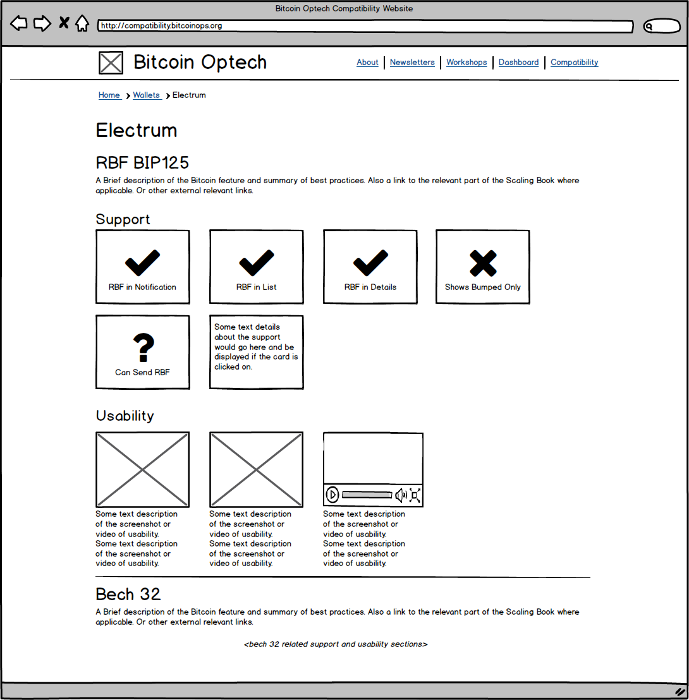
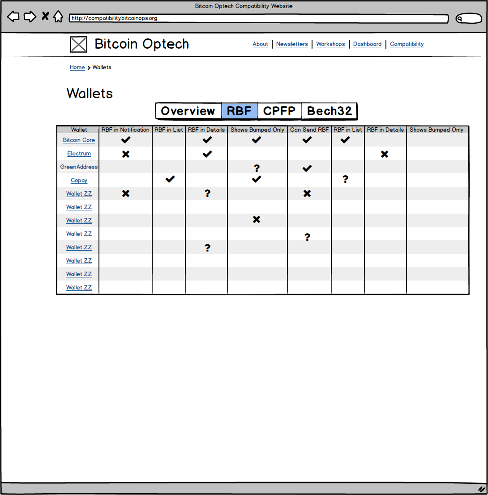

# Bitcoin Optech's Compatibility Website Project Plan

Given the purpose of the website as outlined in the [README](../README.md), we need to provide screens for visitors to:

## View compatibility information for a specific Bitcoin service (exchange, wallet, block explorer, etc)

## View a summary/matrix of compatibility information for a given type of service (exchanges, wallets, explorers) listing all services

